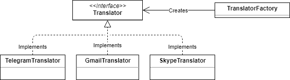

# How to add a new Translator to the Project

First, you need understand what is a translator. 
Figuratively, it's a personal assistant who knows how to speak a specific language 
(in our case, use a social network), 
have a unique client (user) and helps him to speak (send messages) with his contacts.

In other works, each user have one translator for each social network.

Understanding this, we need to know the interface that every translator must follow.

## Interface

Every translator should extends class Translator (It's a abstract class, because python doesn't have interfaces), 
following the Factory Pattern.





The translator class have 3 code to indicate different states and 6 abstract methods to be overridden. 
The class looks like:

```
class Translator(ABC):

    MORE_INFO_CODE = 1 # Indicate that the method need more info or optional parameters
    SUCCESS_CODE = 2 # Indicate that the method finished correctly
    ERROR_CODE = 4 # Indicate that the method fail in the task

    @abstractmethod
    def isConnected(self):
        pass

    @abstractmethod
    def configure(self, data):
        pass

    @abstractmethod
    def sendText(self, message):
        pass

    @abstractmethod
    def sendImage(self, message):
        pass

    @abstractmethod
    def sendVideo(self, message):
        pass

    @abstractmethod
    def sendAudio(self, message):
        pass
```

They should implement the next methods:

### isConnected

This method should verify if the user is currently connected to the social network. 
In order to know if the social network should be configurated or nor.

* Signature: ```def isConnected(self):```
* Return: Boolean


### configure

This method should connect the user to the social network or 
send a request to the social network to allow the connection.

- Signature: ```def isConnected(self, data):```
- Receive:
    - data:
        - Type: Dict
        - Example:
        
        ```
        {
            "username": "string USERNAME_IN_SN",
            "auth_code": "string OPTIONAL PASS_OR_ACCESS_CODE"
        }
        ```
        
        - Indications: The field "auth_code" could be not given in the first call.
        
- Return: 
    - Type: Dict
    - Example: 
    
    ```
    {
        "detail": "string RESPONSE_TEXT",
        "code": integer TRANSLATOR_CODE,
        "redirectURL": "string OPTIONAL URL_TO_REDIRECT_USER"
    }    
    ```
    
    - Indications: 
        - The field "code" is one of the Translator's code show before.
        - The field "redirectURL" exist for oauth2 authentications to redirect user to the properly authentication service.

### sendText, sendImage, sendVideo and sendAudio

This methods have the same structure and should send a message of each kind.


- Signature: ```def sendKIND(self, message):```
- Receive:
    - message:
        - Type: [Message](../models/message.md)
- Return: 
    - Type: Dict
    - Example: 
    
    ```
    {
        "detail": "string RESPONSE_TEXT",
        "code": integer TRANSLATOR_CODE
    }    
    ```


## Enable new Translator

To be able to use the new translator, it should be added to the socialNetworks file (translator/fixtures/socialNetworks.json) 
or directly to the database.

After that, the translator factory (/translator/translators/TranslatorFactory.py) should include the new translator 
in the build method, using the same id added in the database.

## Utils
    
Translator have a common `utils` file with useful functions.

#### Get social network's username from Message

This function return the username of the sender and receiver given a Message object.
The username corresponds to that of the social network specified in the Message object given.

- Signature: ```def getUsernameFromMessage(msg):```
- Receive:
    - msg:
        - Type: [Message](../models/message.md)
        
- Return: 
    - Type: Tuple
    - Example: 
    
    ```
    (
        "string FROM_USER_USERNAME" | None,
        "string TO_USER_USERNAME" | None
    ) 
    ```

#### Get social network's alias from Message

This function return the alias of the sender and receiver given a Message object.
The alias corresponds to that of the social network specified in the Message object given.

- Signature: ```def getAliasFromMessage(msg):```
- Receive:
    - msg:
        - Type: [Message](../models/message.md)
        
- Return: 
    - Type: Tuple
    - Example: 
    
    ```
    (
        "string FROM_USER_ALIAS" | None,
        "string TO_USER_ALIAS" | None
    ) 
    ```

#### Save incoming message

This function save a message receive through the translator into the database.

- Signature: ```def saveIncomingMessage(msg):```
- Receive:
    - msg:
        - Type: dict
        - Example:     
        ```
        {
            "fromUser": User,
            "toUser": User,
            "through": "string SOCIAL_ID",
            "datetime": datetime,
            "content": "string MESSAGE_CONTENT",
            "file": File
        } 
        ```
        - Indications: 
            - [User](https://docs.djangoproject.com/en/1.11/ref/contrib/auth/#django.contrib.auth.models.User)
                refers to the Django User Model.
            - [File](https://docs.djangoproject.com/en/1.11/ref/files/file/)
                refers to the Django File and the property `name` should be replaced with the temporary file location
- Return: 
    - Type: [Message](../models/message.md)

#### Save outcoming message

This function save a message send through the translator into the database.
This function is identical to [Save incoming message](#save-incoming-message) except for the name.

- Signature: ```def saveOutcomingMessage(msg):```